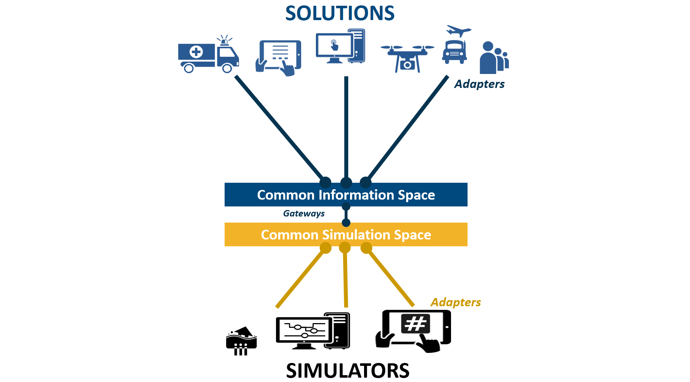

# Executive Summary

The test-bed reference implementation lies at the heart of the Trialling environment of the DRIVER+ project. It provides an open source technical backbone to perform Trials or exercises in a methodical and structured way as it provides a suite of *software* tools to run a Trial or exercise.

The basic problem that the test-bed reference implementation tries to solve is how to connect different solutions, which solve a particular Crisis Management (CM) gap, to:
- **Each other:** since no single application can solve all CM gaps, they need to work together by sharing information.
- **One or more simulators:** since during a Trial or exercise, you cannot start a real incident, there needs to be a way to *simulate* a realistic incident.

The approach that was taken is to connect solutions to a so-called Common Information Space (CIS), simulators to a Common Simulation Space (CSS), and to have gateway services in between that selectively allow some information to pass between the two spaces. These spaces can be public or private, and allow for applications to write messages to a topic of interest, or read those messages. Although both spaces are comparable in that they share well structured messages (using Apache AVRO) over a popular open source distributed messaging system, Apache Kafka, the separation allows for a better control of the message flow, and for replacing parts with an alternative.

In addition, several adapters are created to connect solutions and simulators to the CIS and CSS: besides allowing users of the test-bed to choose an adapter in their favourite programming language, and share messages, it also provides a common interface for configuration, heartbeat messages, and security. Currently, adapters in Java, C#, JavaScript/TypeScript and REST are available, and Python is on its way.

Around this core functionality, additional tools are developed that facilitate the usage of this environment:
- Administrative tools: Is everyone up-and-running, secure, and connected to the right information topics?
- Evaluation tools: What did we observe during the Trial, and what implications does this have during the After-Action Review
- Scenario tools: To create an interesting scenario that triggers the participants and solutions in the right way
- Support tools: For testing and debugging, for creating your personalized test-bed environment, but also to share common data such as map layers or census data.

This document is actually a living document, and the latest version is available [online](https://www.gitbook.com/book/driver-eu/test-bed-design/details) or can be downloaded as PDF or ebook (epub of mobi). It starts on a high-level with a description of the main components of the test-bed reference implementation. Next, chapters are dedicated to the main users of this environment, practitioners and developers/ICT administrators. And it concludes with a brief explanation of the main design decisions.
