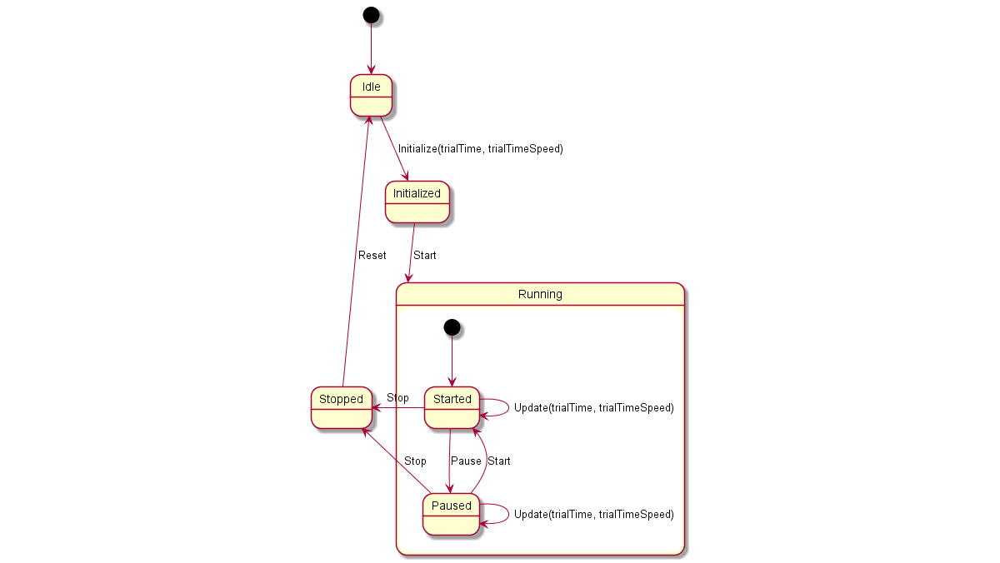

# 4. The test-bed for developers and sysops

A sysops (system operators or system administrators), in the current context, is responsible for installing the test-bed on their local network, and making sure that all the solution and simulation providers can get access to this network as well. This task is discussed in the use case 'Installing the test-bed'.

A developer would be tasked with connecting an existing solution or simulator to the test-bed. Besides the direct coupling, allowing their tools to receive and publish messages, it most likely also involves translating existing messages to their own format. Finally, in case you are connecting a simulator, you also need information more detailed information about the time management in the test-bed.

## 4.1 Use case: Installing the test-bed

The previous chapter already explained how to setup the test-bed. More detailed information about how to run the Docker-compose environment can be found [here](https://github.com/DRIVER-EU/test-bed/tree/master/docker). Alternatively, in the near future, use the [GUI](https://driver-eu.github.io/docker-composer).

As a system administrator, you are also responsible for setting up the local network, such that all solution and simulator providers have access to the local intranet as well as extranet.

In particular, it should be considered that some providers make heavy use of the network, e.g. to download maps, stream video, or access external computer clusters. If that is the case, consider using a throttling service in your network, so one provider does not claim all the network traffic.

More directly related to the test-bed, however, is the connection of all solutions and simulators: are they connected correctly to the test-bed, do they run without errors, are they subscribed to the correct topics, and do they publish to the expected topics, are some of the questions that the admin tool can answer for you. In addition, the admin tool makes sure that all message schemas are available. And when everything is in place, the actual Trial can start. Finally, the admin tool offers a convenient interface to all the other technical test-bed services, such as the REST services, Topics UI, Schema Registry, Kafka Connect, etc.

From then on, the system administrator only needs to check whether the test-bed does not experience any issues.

## 4.2 Use case: Integration process

Assuming you have installed your test-bed locally, to connect your simulator or solution to the test-bed, the generic process is as follows:
-	Choose the adapter in your preferred programming language: [Java](https://github.com/DRIVER-EU/java-test-bed-adapter), [C#](https://github.com/DRIVER-EU/csharp-test-bed-adapter), [JavaScript/TypeScript](https://github.com/DRIVER-EU/node-test-bed-adapter) and [REST](https://github.com/DRIVER-EU/test-bed-rest-service). A Python version will be available in the near future.
-	Define your input/output messages as [AVRO](http://avro.apache.org/docs/current): already supported messages can be found [here](https://github.com/DRIVER-EU/avro-schemas/). Register the AVRO schema with the test-bed via the schema registry (only available after running the test-bed locally, typically at [http://localhost:3601](http://localhost:3601)). You can do that manually, or alternatively, the adapter will do this for you. The registration procedure is a bit different for each adapter.

    Especially in the Common Simulation Space, message formats are less strict, but communication between simulators is more demanding to reduce double work and finding one common “standard” of messages inside the simulation world (see for instance the current item schema that represents a tangible entity in the world).

-	Use the adapter to send messages to the test-bed. You can use the test-bed topics UI to see whether they have arrived correctly.
-	Define some input messages (manually): use our [replay-service](https://github.com/DRIVER-EU/kafka-replay-service) to send them one-by-one or replay a logged sequence of messages. To log the messages in a topic, you can use the [Kafka-topics-logger](https://github.com/DRIVER-EU/kafka-topics-logger) to save them.

    In the near future, you should also have a message injector web app, comparable to Swagger, in which you will be able to create your own messages.  You can use the test-bed topics UI to see whether they have arrived correctly.

-	When your message uses time, you need to query the adapter to get the local Trial time. A first version of the test-bed's [time-service](https://github.com/DRIVER-EU/test-bed-time-service) to manage the Trial time has just been released, and some adapters already offer an interface to it. So there is no need to query the test-bed yourself to get these messages. In case no time messages are available, i.e. we are not running a Trial, it returns the system time.

### Message Topics UI

The test-bed contains a Kafka [topics UI](https://github.com/Landoop/kafka-topics-ui) service to inspect all the message topics that exist (default location [http://localhost:3600](http://localhost:3600)). It can be used to inspect whether you have been successful in sending your messages to the test-bed.

### Schema Registry

The test-bed also contains a [schema registry](https://github.com/Landoop/schema-registry-ui) service to inspect all the available schema's (default location [http://localhost:3601](http://localhost:3601)). As each message topic only has one schema, every message send to a topic needs to comply with that schema too. Also, in case you as a developer are creating new messages, these schema's must first be added to the schema registry, either manually or via an adapter.

### REST service

The test-bed contains a REST service: in case a (legacy) solution is not adaptable, or the solution is developed in a programming language that is not supported, it may be necessary to interact with the test-bed via the [REST service](github.com/DRIVER-EU/test-bed-rest-service).

### Replay service

Connecting to the test-bed is needed to share information that you produce, or consume information from others. While working on integrating your own simulator or solution, however, it is very likely that there are no other simulators or solutions running. When sending messages, you can use the Kafka topics UI to verify that your messages have been delivered. And it is the purpose of the [replay service](https://github.com/DRIVER-EU/kafka-replay-service) to present you with messages to consume.

*For example, assume that you as a developer are tasked to integrate a COP solution. It needs to consume the locations of the rescue vehicles, which are normally generated by a simulator. However, it is a commercial simulator that you do not have. In that case, you request the simulator to run a scenario and publish it to the test-bed. Next, the simulator will log all the messages to file using the [Kafka-topics-logger](https://github.com/DRIVER-EU/kafka-topics-logger). This log file is subsequently sent to the COP solution developer, who can replay it using the replay service, as if it was the simulator was present.*

## 4.3 Gateways for translating messages

As a developer, you may be confronted with message formats you need to consume, but do not support natively in your application. In that case, you can either:
- Adapt your application to support these message formats natively.
- Create a gateway service which translates messages from one message format to a format that your application does understand.

To create such a gateway service is simple: you consume messages from one message topic, convert them, and publish them on another topic. The validation services follow the same approach, and several dedicated services are already available within the [DRIVER+ space on GitHub](https://github.com/DRIVER-EU).

## 4.4 Data services and data sets

Within a Trial or exercise, we need to create a virtual environment where we can safely experiment. This virtual environment is created using data, such as maps, census data, height data, power lines, cell towers, hospitals and care providers, etc. As it is a lot of work to create such a rich data environment, the effort should be shared among the Trial owners, solution and simulator providers. Not only to reduce the workload for a specific organisation, but also to make sure that all parties use the same data. Otherwise, a traffic simulator may use a different roadmap than the simulator that provides a 3D environment, and some roads may be blocked by buildings.

In many cases, real-world data is used, optionally enriched with scenario-specific information. Sometimes, a virtual environment is created, based on real-world data but with altered names.

So in order to share all this gathered data, the test-bed offers two types of services:
- Docker *volume images* to store all this information together, so the data can be easily shared. A test-bed user can simply pull the volume image from the Docker hub to have all data instantly available
- *Data services*, to share this data with all users, e.g. there is an [MBtiles service](https://github.com/DRIVER-EU/test-bed-mbtiles-service) to offer map images to COP and COP-like tools, or a [WMS service](https://github.com/DRIVER-EU/test-bed-wms-service) that translate test-bed messages to WMS map layers available to make the information available to legacy systems.

**Security** is yet another reason to have these data services and data sets as part of the test-bed. Not all Trials and exercises have open access to the Internet, but they still need access to this kind of data.

## 4.5 Time management

A Trial or exercise typically is not performed in real-time: either because the incident occurs at night, and people prefer to Trial and train during working hours, because you wish to skip boring parts, or because it would simply take too long. An example of the latter is a flooding incident, which can start days before any flooding actually occurs, so you need to compress the scenario to normal working hours.

Within the test-bed, therefore, the scenario time (a.k.a. Trial time or fictive time) is controlled via the [time service](https://github.com/DRIVER-EU/test-bed-time-service) using [two types of messages](https://github.com/DRIVER-EU/avro-schemas/tree/master/core/time): one for controlling the time, and one for informing adapters about the current scenario time.

As a developer, you do not need to interact with these messages directly, since:
- Every adapter has a time interface to get the current scenario time. Even as a solution developer, you should also use this time to timestamp the messages that you send. For example, if inside your message you refer to a particular time, always base it on the scenario time.
- Every adapter has a state describing the current scenario phase, which you can optionally use during the integration:
  - Idle: no scenario has started. The time interface returns the system time.
  - Initialized: the scenario is ready to be started. All adapters will receive the scenario start time, and can use this to initialize their service. In the near future, adapters have the ability to inform the test-bed when they are initialized and ready to start.
  - Running (started or paused): the scenario time is moving forward, either in real speed or slower/faster than normally. In case the scenario is paused, the current scenario time is still actively being distributed, but does not progress (speed is 0).
  - Stopped: The scenario is stopped, and the simulation time is no longer being updated.

Even though you do not interface with the time messages, you still need to use the time interface when you need to send a message with a timestamp inside. This timestamp should use the current scenario time. Similarly, in case you display the 'actual' time in your user interface, please also use the current scenario time.

### System time versus scenario time

In Trials executed in the past, the operating system (OS) time was also adjusted to match the scenario time. The advantage was that if you would check the time in your status bar, it would display the current scenario time instead of the real time. Although this is straightforward to do, your OS does not like it, as it will generate files in the past or future, and may mess up your system. Especially when the scenario is paused. That's why the current test-bed does not require you to synchronize your system time to the scenario time.

### A word about HLA and DIS

Within the Modelling & Simulation community, especially for military use, there are two simulation standards, HLA (High Level Architecture) and DIS (Distributed Interactive Simulation), which are the norm. The reasons why we did not use these standards, not even for the CSS, are:
- They are used for connecting simulators to each other, not for connecting solutions to simulators nor solutions to other solutions.
- Their message format is fixed: if you want to send other information, you have to 're-purpose' existing fields, which is not considered a best practice. Also, they have no support for any CM standard.
- Both have a steep learning curve.
- HLA and DIS form a very small community, so it is difficult to hire people with this knowledge, and you typically have to train general software engineers by yourself. Second, it is difficult to find solutions for a particular problem on the Internet.
- HLA and DIS expect everyone to use Java or C++, and there is even less support for the 'newer' programming languages, like C#, JavaScript, Python, etc.
- HLA requires a run-time infrastructure, which is a kind of test-bed: there are two commercial providers that are rather expensive. Although there is one [open source version](https://github.com/openlvc/portico), it is feature incomplete and not well maintained. Although these versions should be interoperable, they are not, and they cannot be mixed.

That's why this test-bed is using popular open source software, so it is easy to find:
- Open source tools to support it, or to connect to it, in many programming languages
- Answers to questions
- People that can use it
- A new schema representing your message
- And there is no financial hurdle preventing adoption

Even though the test-bed does not use HLA or DIS internally, there are many simulators that provide a HLA or DIS export, and that can be useful for a Trial or exercise. In those cases, a HLA or DIS simulation environment can be created, as is done normally, including a gateway service to bridge the gap with our test-bed: typically, such a gateway has an HLA connector to retrieve information from the HLA/DIS side, and a subset of the information is published in the CSS. And vice versa. Even though this kind of integration if suboptimal, in practice, this is not really noticeable.