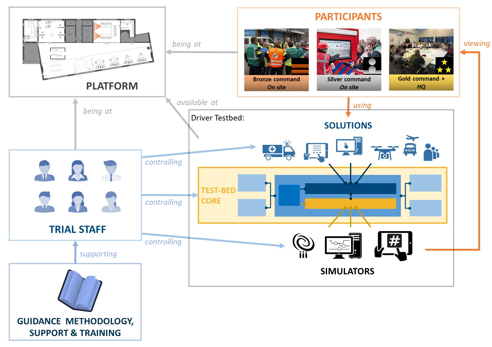
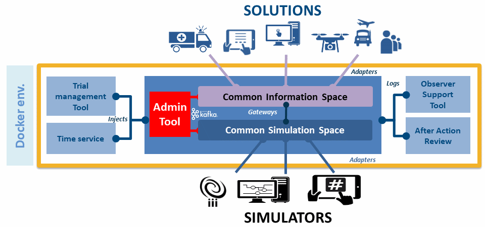

# 1. Introduction

In the Crisis Management (CM) domain, practitioners need to be prepared for the unexpected: based on past experience and the local incidents they had to deal with, they develop a feeling for the things that did not go so well. As with most incidents many lives are involved, they are continuously looking for solutions to improve their response and preparedness.

Within the [DRIVER+ project](http://www.driver-project.eu), a Trial Guidance Methodology (TGM, deliverable D922.21 - Trial guidance methodology and guidance tool specifications (version 1)) and tools are developed to help resolve the needs of practitioners through a systematic and pragmatic approach. The Test-bed infrastructure is a suite of software tools and services that enables solutions and simulators in the Crisis Management (CM) domain to easily exchange information (see Figure 4). This allows end-users in the CM domain to Trial solutions, and see if they address their gaps. Additionally,it can be used to support training exercises as well.

The simplified DRIVER+ TGM process to Trial solutions is like this:

1. PREPARATION PHASE:

   - The operational issues practitioners experience are matched with one or more of the well-known crisis management gaps, as experienced by many of their colleagues, e.g. *How to get a real-time and dynamic overview of the position of all personnel?*.
   - These gaps, in turn, are still too generic to address, and are made more specific, leading to so-called 'research questions', e.g. *Which Situational Awareness-increasing solution fits best with our mode of operation?*
   - Existing solutions are reviewed and selected. Some solutions can even be tried out standalone using the Test-bed and an existing mini-scenario.
   - Based on the selected solutions, gaps and research questions, a data collection plan is developed: what kind of data does the Trial need to generate to enable a valid evaluation at the end of the Trial.
   - A scenario is developed that puts these solutions to the test. This includes selecting and connecting simulators of a fictive incident, e.g. a flooding simulator, and other simulators to create a realistic environment, e.g. a traffic simulator.
   - Selected solutions and existing legacy systems are connected to the Test-bed, so they can receive input from the simulators as well as each other.

2. EXECUTION PHASE:

   The Test-bed is setup, all simulators and solutions are connected, data collection is in place, and a scenario can be run (executed). Before the actual Trial, several dry runs are performed, partially for testing the setup, and partially for training the participants in using the solutions. This phase ends when the Trial is executed and observed.

3. EVALUATION PHASE:

   Based on the recorded observations and collected data (screenshots of running applications, messages sent, actions and decisions taken) during the Trial, the solutions are evaluated with the participants, leading to a good appreciation of how the selected solutions have contributed to solving the problems.

## 1.1 Aim

The Test-bed supports practitioners by providing an environment in which they can easily Trial new solutions and run exercises. This has several implications for the test-bed:

- **Evaluation support:** As we are testing and evaluating new solutions, the Test-bed provides tools for observers and After-Action Review.
- **Simulation support:** Due to the nature of the crisis management domain, most solutions cannot be properly tested outside an actual crisis situation. As starting a flooding or burning a forest is clearly not an option to test the solutions, the crisis incident needs to be faked or simulated. The same applies to expected reactions of the environment: people panicking, traffic jams, etc. must be simulated too.
- **Execution support:** As the solutions are typically tested within an incident scenario, the Test-bed provides tools to create and execute scenario's.
- **Development support:** To connect new solutions and simulators to the Test-bed, the Test-bed provides adapters in several popular languages and several debugging tools and services. Also, to check whether everything is up-and-running smoothly, it also has an admin tool.

## 1.2 Scope of the Test-bed

This document limits its scope to the core Test-bed design, more specifically, the design of the Test-bed's reference implementation, which is an implementation of the [Test-bed specification](https://driver-eu.gitbooks.io/test-bed-specification) (see Figure 5): it thereby provides an overview of the most important components of the Test-bed, how they work together, and how they can be used by different stakeholders.

The CM solutions and simulators that supplement the Test-bed, however, are *not* part of the Test-bed. The simulators' function is to simulate an incident, and the reactions that may occur in a real world, since we cannot unleash incidents like a flooding and earthquakes on the real world. The solutions are the actual tools that are trialled and evaluated, and measured whether they actually do solve a CM gap. These solutions are fed with the simulator's output, and perhaps the output of other solutions, so end users can observe and evaluate their contribution during a fictive incident.

## 1.3 Organisation of the Document

This is a live document, and the latest version can always be found online at [https://driver-eu.github.io/test-bed-design](https://https://driver-eu.github.io/test-bed-design). It is organised as follows:

The [Test-bed description](test-bed-description.md) provides a general overview of the Test-bed reference implementation. It is an easy to read chapter which requires little technical knowledge, and is aimed at anyone who has to work with the Test-bed.

The chapter, [Test-bed for Trial owners](Trial-owners.md), is specifically aimed at Trial owners and practitioners, and discusses the functionality the Test-bed offers to them. And also, what it does not offer.

In the chapter, [Test-bed for developers and sysops](developers.md), the technical side of the Test-bed is explained. Specifically: how to manage a Test-bed as a sysop, or how to connect a solution or simulator to it as a developer.

The final chapter offers more details about the [Test-bed design](design.md), and provides an explanation for the main design decisions. The intended audience are developers that need a deeper understanding of the Test-bed and its underlying architecture, e.g. for supplementing the Test-bed or for offering a deeper integration of their solution.

For **reviewers**, in case you have read previous versions of this document, please refer to [Annex 1 Change history](changes.md) to see what has changed.

## 1.4 What's new

### Version 1 (2018-03-31)

This is deliverable D923.21, describing the first version of the Test-bed reference implementation. It matches the release version of the software applications as available on GitHub: [github.com/DRIVER-EU](https://github.com/DRIVER-EU). Two future releases of this document are planned, v2 and v3, and the major changes between the different documents will be described here. In the mean time, this online documentation is continuously updated, so it matches the current state of the Test-bed.

### Version 2 (2018-11-30)

This is deliverable D923.22, describing the second version of the Test-bed reference implementation v1. All changes with respect to the previous version are documented in [Annex 2 Change history](changes.md).