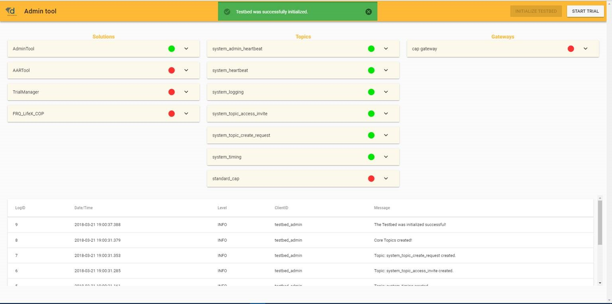
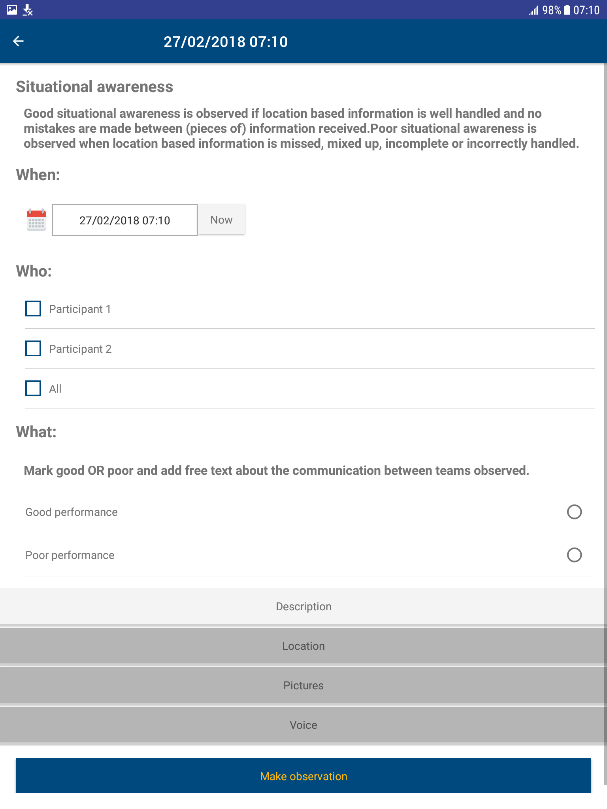

# Test-bed description

The test-bed supports practitioners by providing an environment in which they can easily Trial new solutions and run exercises. In this chapter, the main components of the test-bed are explained.

## Core

The test-bed must support the exchange of information between distributed solutions, simulators and tools. Information such as the location of an incident, alert messages, or the locations of vehicles. Comparable to people exchanging information via email, chat or twitter, the test-bed exchanges information using the open-source messaging system [Apache Kafka](https://kafka.apache.org) from the [Apache organisation](http://www.apache.org/).

As it is assumed that the systems the test-bed connecting are either software systems, or hardware with a software interface, the test-bed support for non-technical systems is limited: typically, support will be limited to the evaluation tools, such as the observer support tool and After-Action Review tool.

### Adapters

Being popular, Kafka has connectors for most programming languages, so software applications can easily be connected to it. While connected to Kafka, and therefore the test-bed, the application can send and receive messages. When you want to receive a message, you subscribe to a topic of interest: thereafter, you get all the messages that are sent instantaneously until you end your subscription. Optionally, you can even get messages that were sent previously, or while you were offline. To publish a message, you send it to your topic of interest.

*For example, to send a CAP (Common Alerting Protocol) message to all interested parties, you use a connector to send your CAP message to the cap topic. Every tool that has subscribed to the cap topic will get it right away.*

The default Kafka connectors are lacking certain features that are useful in a test-bed environment, so some existing connectors have been extended. These extended connectors are called **adapters**, and the test-bed currently maintains four of them: in [Java](https://github.com/DRIVER-EU/java-test-bed-adapter), [C#](https://github.com/DRIVER-EU/csharp-test-bed-adapter), [JavaScript/TypeScript](https://github.com/DRIVER-EU/node-test-bed-adapter) and [REST](https://github.com/DRIVER-EU/test-bed-rest-service). Note that the REST adapter is a simple interface so any application can send and receive messages using basic internet commands.

Adapters extend regular Kafka connectors with:
- *Heartbeat signals:* Before you can start a Trial, every solution, simulator and tool needs to be up-and-running. Therefore every adapter transmits a heartbeat signal every 5 seconds to inform others it is online.
- *Logging:* Besides being online, it is also important to know that each connected service is running as expected, so each adapter offers the option to log warnings/errors to the test-bed as well.
- *Configuration options:* The adapter can inform others to what topics it subscribes and publishes. In addition, this can be configured too externally.
- *Time:* A Trial scenario typically will not run at real-time, so the adapter needs to share the fictive simulation time. In addition, it shares the simulation speed, as we may be running slower or faster than real-time, as well as the simulation state.

### Messages

As computers are still less flexible than people in *understanding* messages, the test-bed has to assure that every message that is sent complies with the expected format (syntax). For example, when a solution wants to share the location of a vehicle or the value of a sensor, you probably need to capture the vehicle's or sensor's location, as well as its type, speed or sensor value. Then it is important to know that the type will be one out of a list of possibilities, that the location is specified using two numbers, and that the speed or sensor value is a number too.

To capture this information, the common solution is to specify it in a so-called schema. The test-bed enforces this too, and is uses the open [Apache AVRO](https://avro.apache.org) schema format.

**Dealing with standards:** In the CM domain, several standards exists, such as CAP, EDXL or EMSI. They are represented using XML, a textual representation of a message that is easily readable by computers. A recurring problem with all standards, however, is that they rarely represent all the information you would like to share. This often leads to adding new fields, or, even worse, *re-purposing* existing fields. Additionally, not every organisation uses it in the same way. For Trialling new solutions, the test-bed needs to be flexible and exact, and that's why the test-bed does support these standards, but converted to the AVRO format. In that way, every connected solution or simulator will exactly know what to expect when reading a message, as new fields can be easily added in a robust way.

### CIS and CSS

At the heart of the test-bed, i.e. its [core](#core), all messages are exchanged using [Apache Kafka](https://kafka.apache.org). Conceptually, though, we distinguish between a Common Information Space (CIS) and a Common Simulation Space (CSS). The CIS is where the solutions exchange information, and the CSS is for simulators. Typically, the CIS will exchange far less messages during a Trial, and time synchronisation is simple. In the CSS, much more messages are generated, e.g. the location of all vehicles may be updated every second, and simulators may need to be in sync with others, e.g. a flooding simulator may flood an area, and at the same time, the traffic in the same area should experience the flood too.

For not too complex Trials, the CSS and CIS will run in the same test-bed. In case the performance suffers, it may be necessary to split the CSS and CIS over two test-beds that are connected to each other.

Note, though, that the [adapters](#adapters) connect to the CIS as well as the CSS, so there is no difference between them.

### Gateways and Validation Services

Even while using well defined messages based on [Apache AVRO](https://avro.apache.org), it is certain that not all solutions and simulators speak each other's 'language'. Like in Europe, as not everyone is speaking Esperanto or English and there is a need for translators, in the test-bed we need *gateways* to translate one topic's message to another. Examples are not only translating one message format to another, but for example to translate:
- A message from a simulator sharing the location of all vehicles, to a COP tool message that only contains the location of its own resources
- An EDXL Resource Management request from a COP tool to a simulator message, which in turn sends out an ambulance to the required location.

In order to facilitate solution tools to obtain their needed information from the simulated world, the CSS needs to be connected with the CIS by means of translator applications, residing in the CIS-CSS Gateway. These translator applications form the bridge between de simulated truth and the perceived/communicated truth by mapping the relevant changes from the simulated world to messages globally understood in the CIS.

An example of this would be a simulation of a flooding. Imagine a river that has a rising water level due to increase of rain water. At the river bank, there are several sensors that react to the amount of water coming in contact with the sensor. An application is created and connected to current operational systems to send CAP messages regarding the water level in clear categories ranging from LOW to DANGEROUSLY HIGH. A possible solution is assessed on improving decision-making based on the messages outputted by the created sensor application.

In this example, the water in the river is handled inside the CSS by means of a simulator focussed at calculating water levels at exact locations. The sensor application would be a translator application or gateway, mapping the current water levels obtained from the CSS into the messages with understandable categories (and, for instance, only sending them whenever a change in category is observed) similar to the operational application. The tool connected to the CIS listens to the formatted messages of the translator application as if it was connected to the actual operational application.

There are also tools that will send out messages that serve as commands or requests to change the simulated world (e.g. Command & Control systems used to trigger procedures to be executed by units, which in case of a Trial are simulated). Again, a gateway would be used to bridge the two spaces together. For example, a new dispatch centre solution (i.e. a type of COP system) that allows the user to send out emergency services from their dispatch towards the incident location. The solution would send out a standard resource management message via the CIS. The gateway service picks up the message and maps it towards the corresponding request for changing the simulation space. The responsible simulator would receive this request via the CSS and handles it, changing the respective simulation entity (i.e. letting a simulated unit drive in the simulated world).

**Validation Services** are specific gateways that, as the name suggests, validate a message in more detail, before it is passed on to other systems. For example, if application A is publishing a CAP (Common Alerting Protocol) message for application B, i.e. A --> CAP topic --> B, the test-bed will make sure that it complies with the appropriate schema before passing it on. However, there may still be certain aspects in the message that are not completely correct, e.g. the alerting area that is represented as a polygon may not have the same starting and ending point (i.e. it should be closed), or the incident location that is represented by two numbers (x, y), may actually be published as (y, x). So during testing, the validation service can 'intercept' messages between A and B and validate them in detail. Only valid messages are passed on, i.e. A --> CAP validation topic --> CAP topic --> B.

## Test-bed administration tool

The test-bed is a collection of distributed services running in a network environment. You can compare it to a theatre play, where the stage needs to be prepared, the musicians must be ready, as well as the light and sound engineers. The test-bed admin tool helps you by monitoring both the CIS and the CSS to support understanding what is/was going on during a trail: to determine whether all services are ready, and that their inputs and outputs are correct. Also in case a service encounters any errors, this is made visible and the errors can be inspected - are they serious and do we need to stop our Trial, or can we ignore them safely and run on.

This does not only apply to the test-bed's core tools, gateways and services, but also for the connected simulators and solutions.

Detailed information:
- [Functional specification](https://driver-eu.gitbooks.io/test-bed-specification/technical-requirements.html)
- [Website](https://github.com/DRIVER-EU/test-bed-admin)

## Trialling, Exercising and Scenario Management

Whether designing a **Trial** to evaluate solutions, or an **exercise** to train people, a scenario and, optionally, simulations, are needed to emerge the training audience and to give them the feeling that they are dealing with an actual crisis.

For an exercise, one starts by defining the *training objectives*, *What does the training audience need to learn?*. Next, an appropriate *Mission / Main scenario* is formulated in which these training objectives can be tested and exercised. The mission if further broken down into *storylines*. A Storyline describes a developing situation that will set conditions and provide the Training Audience an opportunity to achieve a specific Training Objective and optional secondary Training Objectives. It often targets a subset of the training audience, e.g. only the fire fighters, and consists of timed events, or so called *injects*. Think of an email to the commander, a 'start flooding' message to a flooding simulator, or instructions to a role-playing actor.

In a **Trial**, although the primary objective is not to train people, but to test and evaluate solutions, still a similar procedure can be followed. In that case, the *training objectives* are replaced by *solution objectives / research questions*, but the other steps remain the same.

### Existing software

The process described above is the typical approach taken by the NATO Joint Exercise Management Module ([JEMM](http://slideplayer.com/slide/7873364)). It is a tool to support live exercises as well as table top exercises, from a few people to battalions. It puts a lot of emphasis on authorization management (*who can do what?*) during the creation of a scenario, and has a limited level of automation. For example, JEMM can connect to Outlook / Exchange Server to automatically create or receive email messages. Sending, though, is still a manual process.

JEMM is available free of charge to military NATO members, i.e. to use it in a Trial, a military presence is required.

Alternative commercial solutions exist too, such as [Exonaut](https://www.4cstrategies.com/exonaut-products/training-and-exercise-manager). They also aim at a military audience, and follow a similar approach.

### Scenario manager

A scenario manager is an integral part of the test-bed reference implementation too, since it is not possible to use JEMM or Exonaut directly, as:
- JEMM is only available to NATO members, and can only be used in a Trial or exercise when military personnel requests it. This will not always be the case.
- JEMM and Exonaut are aimed at the military community, and the fit with the Crisis Management domain is not optimal.
- JEMM and Exonaut are closed source, so a strong integration with the test-bed is not possible, as the applications cannot be modified.

The test-bed's scenario manager, then, acts as the *composer* and *conductor* of a classical performance:
- As the *composer*, it defines what each role has to play. For example, what do the simulators or role-players need to do in order to provide a realistic incident and background to the Trial, or it could include sending direct messages to solutions.
- As the *conductor*, it controls *when* each role starts and stops.

Additionally, the scenario manager will also publish messages that are not directly related to the scenario itself. For example, it can send a message to the observers, informing them that they need to pay attention, as something important is going to happen soon. Or it could ask these observers specific questions during the Trial, e.g. '*Did you notice that X occurred?*'. These messages are also important for the after-action review, as they can be used as bookmarks to quickly go to parts in the scenario that are of extra importance for the evaluation.

Detailed information:
- [Functional specification](https://driver-eu.gitbooks.io/test-bed-specification/technical-requirements.html)

## Evaluation

Evaluation is needed to verify that the Trial or training objectives have been achieved. The test-bed provides two services for this: an Online Observer Support tool and an After-Action Review tool.

### Online Observer Support tool

Based on the specified objectives of the Trial or exercise, an observer expects to observe different kinds of behaviour. At the same time, there is little time during a Trial to record behaviour, as the Trial runs on, and that's why the observer tool provides Trial-specific pre-made forms (templates) to quickly create a new observation. For example, *Did you observe role X do Y? Yes/No*. These Trial-specific forms are created before the Trial by the observation team manager in the administration panel. Using this panel, specific forms can be assigned to specific observers. The observer can use a tablet, phone or desktop application for his work.

Although the observer tool can run standalone, outside the test-bed, it really shines when it is connected, as this allows:
- To share observations with Trial staff: they can use this information to steer the Trial in another direction.
- The After-Action Review tool can use the observations during the analysis and evaluation
- The scenario manager can inform the observers of major events that are about to occur: so they can finish drinking their coffee and are warned ahead of time
- Observation forms can be created dynamically and transmitted to one or all observers

Detailed information:
- [Functional specification](https://driver-eu.gitbooks.io/test-bed-specification/technical-requirements.html)
- [Website](https://github.com/DRIVER-EU/ost)
- [Documentation](https://driver-eu.gitbooks.io/specification-of-the-online-observer-support-tool/)

### After-Action Review tool

The After-Action Review (AAR) tool provides the possibility to collect data after a Trial has finished and analyse it. Its main purpose is to facilitate the evaluation of the Trialled solutions against the predefined objectives, and to help the participants determine how well they functioned. It collects messages (exchanged during Trial), observation reports and takes screen-shots of the applications during their use.

Detailed information:
- [Functional specification](https://driver-eu.gitbooks.io/test-bed-specification/technical-requirements.html)

## Simulation

Much can be said on the subject of simulation, but for the purpose of this chapter, it suffices to provide a brief overview of the test-bed's relation to simulation.

In the test-bed, the goal of simulation is to provide a realistic, immersive background for the Trial or exercise. Typically, this requires:
- A **simulation of the incident** e.g. a flooding, earthquake or explosion, etc. simulation
- A **simulation of the reactions** to the incident, e.g. people running away or drowning, buildings collapsing, road jams or traffic accidents, etc.
- A **simulation of the perceived world**, i.e. painting a picture of the world to solutions of what they are reasonably expected to see, not what is actually happening. For example, when an area is flooded in the simulation, all simulators know the exact location of the water. So if people are standing knee-deep in the water, or a road is inaccessible due to water, that can be shown and used. However, a COP tool or other solution does not have such a perfect view of what is happening in the world. It does not know where everyone is, nor the exact location of the water level. As long as it has no sensors, cameras, drones, or people informing it, it may well believe that the flooding is in an entirely different location or not happening at all. In a recent CM exercise, it took the participants quite some time to figure out that the water was actually threatening their own location, and they hadn't taken the necessary precautions. A well-designed Trial, therefore, needs to think about how they are going to present the simulated world within the Trial.

The test-bed, therefore, offers support to simulators for creating this realistic and immersive background, by:
- Providing a time-service: i.e. each adapter knows the scenario time, so simulators and solutions can use this in their user interface and calculations. Think of a clock display, but also when sending an email or CAP message, making sure it uses the correct timestamps.
- The scenario manager, as discussed above.

It does not, however, provide these simulators as an integral part of the test-bed. They are, and shall always remain, external. Even though some simulators will be connected during the project, they are external, as as such, also not bound by the open source requirements that the test-bed has to adhere too. For example:
- XVR connects their 3D crisis management environment, Crisis Media and Resource Manager to the test-bed, thereby offering their (commercial) services to other parties too.
- DLR connects their open source SUMO (Simulation of Urban Mobility) traffic simulator to the test-bed, which provides realistic traffic during an incident
- Thales connects their commercial Crowd Simulator to the test-bed, e.g. providing a realistic simulation of people in need during a crisis.

### A note about Simulators

All simulators have their own data model of how they represent the simulated world. The CSS allows these simulators to agree on a communication form that the simulators understand to create and maintain a jointly simulated world.

The simulators only need to be concerned with maintaining the current state of a given location (including entities and processes present at that location), and do not have to deal with the different kinds of communication types for tools and users to depict that current state.

The CSS allows simulators to only focus on maintaining the current state of the simulated world (i.e. the simulated truth of the incident and the world around it). In order to communicate state changes with other simulators inside the CSS, self-created communication messages are allowed inside this space. This is different than the messages being sent over the CIS, because the CIS is more aligned with current emergency management standards (like Common Alerting Protocol (CAP) messages, or Emergency Data Exchange Language (EDXL) messages).
