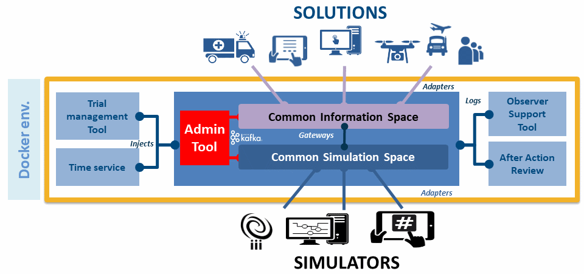

# Test-bed description

The test-bed supports practitioners by providing an environment in which they can easily trial new solutions and run exercises. In this chapter, the main components of the test-bed are explained.

## Core

The test-bed must support the exchange of information between distributed solutions, simulators and tools. Information such as the location of an incident, alert messages, or the locations of vehicles. Comparable to people exchanging information via email, chat or twitter, the test-bed exchanges information using the open-source messaging system [Apache Kafka](https://kafka.apache.org) from the [Apache organisation](http://www.apache.org/).

As it is assumed that the systems the test-bed connecting are either software systems, or hardware with a software interface, the test-bed support for non-technical systems is limited: typically, support will be limited to the evaluation tools, such as the observer support tool and After-Action Review tool.

### Adapters

Being popular, Kafka has connectors for most programming languages, so software applications can easily be connected to it. While connected to Kafka, and therefore the test-bed, the application can send and receive messages. When you want to receive a message, you subscribe to a topic of interest: thereafter, you get all the messages that are sent instantaneously until you end your subscription. Optionally, you can even get messages that were sent previously, or while you were offline. To publish a message, you send it to your topic of interest.

*For example, to send a CAP (Common Alerting Protocol) message to all interested parties, you use a connector to send your CAP message to the cap topic. Every tool that has subscribed to the cap topic will get it right away.*

The default Kafka connectors are lacking certain features that are useful in a test-bed environment, so some existing connectors have been extended. These extended connectors are called **adapters**, and the test-bed currently maintains four of them: in [Java](https://github.com/DRIVER-EU/java-test-bed-adapter), [C#](https://github.com/DRIVER-EU/csharp-test-bed-adapter), [JavaScript/TypeScript](https://github.com/DRIVER-EU/node-test-bed-adapter) and [REST](https://github.com/DRIVER-EU/test-bed-rest-service). Note that the REST adapter is a simple interface so any application can send and receive messages using basic internet commands.

Adapters extend regular connectors with:
- *Heartbeat signals:* Before you can start a trial, every solution, simulator and tool needs to be up-and-running. Therefore every adapter transmits a heartbeat signal every 5 seconds to inform others it is online.
- *Logging:* Besides being online, it is also important to know that each connected service is running as expected, so each adapter offers the option to log warnings/errors to the test-bed as well.
- *Configuration options:* The adapter can inform others to what topics it subscribes and publishes. In addition, this can be configured too externally.
- *Time:* A trial scenario typically will not run at real-time, so the adapter needs to share the fictive simulation time. In addition, it shares the simulation speed, as we may be running slower or faster than real-time, as well as the simulation state.

### Messages

As computers are still less flexible than people in *understanding* messages, the test-bed has to assure that every message that is sent complies with the expected format (syntax). For example, when a solution wants to share the location of a vehicle or the value of a sensor, you probably need to capture the vehicle's or sensor's location, as well as its type, speed or sensor value. Then it is important to know that the type will be one out of a list of possibilities, that the location is specified using two numbers, and that the speed or sensor value is a number too.

To capture this information, the common solution is to specify it in a so-called schema. The test-bed enforces this too, and is uses the open [Apache AVRO](https://avro.apache.org) schema format.

**Dealing with standards:** In the CM domain, several standards exists, such as CAP, EDXL or EMSI. They are represented using XML, a textual representation of a message that is easily readable by computers. A recurring problem with all standards, however, is that they rarely represent all the information you would like to share. This often leads to adding new fields, or, even worse, *re-purposing* existing fields. Additionally, not every organisation uses it in the same way. For trialling new solutions, the test-bed needs to be flexible and exact, and that's why the test-bed does support these standards, but converted to the AVRO format. In that way, every connected solution or simulator will exactly know what to expect when reading a message, as new fields can be easily added in a robust way.

### CIS and CSS

At the heart of the test-bed, i.e. its [core](#core), all messages are exchanged using [Apache Kafka](https://kafka.apache.org). Conceptually, though, we distinguish between a Common Information Space (CIS) and a Common Simulation Space (CSS). The CIS is where the solutions exchange information, and the CSS is for simulators. Typically, the CIS will exchange far less messages during a trial, and time synchronisation is simple. In the CSS, much more messages are generated, e.g. the location of all vehicles may be updated every second, and simulators may need to be in sync with others, e.g. a flooding simulator may flood an area, and at the same time, the traffic in the same area should experience the flood too.

For not too complex trials, the CSS and CIS will run in the same test-bed. In case the performance suffers, it may be necessary to split the CSS and CIS over two test-beds that are connected to each other.

Note though that the [adapters](#adapters) connect to the CIS as well as the CSS, so there is no difference between them.

### Gateways and Validation Services

Even while using well defined messages based on [Apache AVRO](https://avro.apache.org), it is certain that not all solutions and simulators speak each other's 'language'. Like in Europe, as not everyone is speaking Esperanto or English and there is a need for translators, in the test-bed we need *gateways* to translate one topic's message to another. Examples are not only translating one message format to another, but for example to translate:
- A message from a simulator sharing the location of all vehicles, to a COP tool message that only contains the location of its own resources
- An EDXL Resource Management request from a COP tool to a simulator message, which in turn sends out an ambulance to the required location.

*Validation Services* are specific gateways that, as the name suggests, validate a message in more detail, before it is passed on to other systems. For example, if application A is publishing a CAP (Common Alerting Protocol) message for application B, i.e. A --> CAP topic --> B, the test-bed will make sure that it complies with the appropriate schema before passing it on. However, there may still be certain aspects in the message that are not completely correct, e.g. the alerting area that is represented as a polygon may not have the same starting and ending point (i.e. it should be closed), or the incident location that is represented by two numbers (x, y), may actually be published as (y, x). So during testing, the validation service can 'intercept' messages between A and B and validate them in detail. Only valid messages are passed on, i.e. A --> CAP validation topic --> CAP topic --> B.

## Trialling and Scenario Management

## Evaluation

## Simulation

