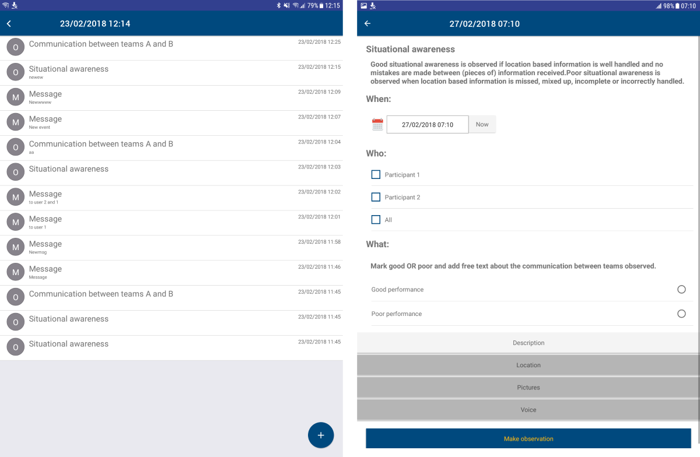

# 3. Test-bed description

The Test-bed supports practitioners by providing an environment in which they can easily Trial new solutions and run exercises. In this chapter, the main components of the Test-bed are explained (see [Figure 3](./README.md#fig1.2.3)) and is aimed at a fairly technical audience. A shorter version was recently presented at ITEC2019, "An interoperability Framework for Trials and Exercises", by Hendriks, Vullings, Van Campen2, and Hameete.

Although most trialled DRIVER+ solutions are software systems, the Test-bed also offers excellent support for non-software systems, such as a new process or procedure.

- The Test-bed's technical infrastructure can be used to put a new process in a relevant crisis-management context. For example, the open source [SUMO tool](http://sumo.sourceforge.net/) could be used to simulate traffic, and the open source [csCOP tool](https://github.com/DRIVER-EU/csCOP) could be used to offer the participants a realistic common operational picture during their Trial. There are also organisations that provide commercial support to provide the Test-bed with realistic incident visualisations.
- Within the Test-bed, there are three tools that can also be of direct value for trialling new procedures: the Trial-Management-Tool ([see Section 3.3](test-bed-description.md#trial-management-tool)), the Observer-Support-Tool ([Section 3.4](test-bed-description.md#online-observer-support-tool)), and the After-Action-Review tool ([Section 3.4](test-bed-description.md#after-action-review-tool)). The first to provide stimuli to the procedure, the second to capture all observations, and the last to review the whole trial session.

## 3.1 Core

The Test-bed must support the exchange of information between solutions, simulators and tools. Information such as the location of an incident, alert messages, or the locations of vehicles. Comparable to people exchanging information via email, chat or twitter, the Test-bed exchanges information using the open-source messaging system [Apache Kafka](https://kafka.apache.org) from the [Apache organisation](http://www.apache.org/). These messages can have different effects, for example:

- Display a message to an end-user such as an email or an alert on a map.
- Track the location of your own people on a map.
- Share the current situational status between CM solutions.
- Dispatch an ambulance to the incident location.
- Receive an update of the wildfire location from the drone system.
- Trigger a flooding simulator to send a new flood map.
- Make part of the road network inaccessible for traffic.
- Sharing an observation made by an observer, which can be used as input to the CM scenario.
- Send a message to a role-player, who subsequently makes a call as a concerned citizen to the crisis communication centre.
- Mark the begin or end of a CM phase, useful for after action analysis.

Although already many messages are implemented, it is easy to add more, based on the needs of the actual Trial.

Each message is published in a so-called _topic_, where each topic can only be used for one type of message. To receive these messages, all an application needs to do is to subscribe to the topic of interest, using an adapter.

### Adapters

Adapters are used to connect solutions and simulators to the Test-bed in order to exchange information. As the Test-bed is based on Apache Kafka, which is used worldwide, there are connectors for most programming languages, so software applications can easily connect to it. While connected to the Test-bed, an application can send and/or receive messages. When you want to *receive* a message, you subscribe to a topic of interest: thereafter, you get all the messages that are published until you end your subscription. Optionally, you can even receive messages that were published in the past, or while you were offline, as Kafka logs all messages for a configurable time. This is especially useful for mobile services that are not always connected to a network. To *publish* a message, you just need to send it to a topic of interest and every interested application that has subscribed to this topic receives it instantly.

*For example, to publish a CAP (Common Alerting Protocol) message to all interested parties, you use an adapter to send your CAP message to the 'cap' topic. Every tool that has subscribed to the 'cap' topic will get it right away.*

The default Kafka connectors, however, are lacking certain features that are useful in a Test-bed environment, so several existing connectors have been extended. These extended connectors are called **adapters**, which extend regular Kafka connectors with:

- *Heartbeat signals:* Before you can start a Trial, every solution, simulator and tool needs to be up-and-running. Therefore every adapter transmits a heartbeat signal every 5 seconds to inform others it is online. This is monitored in the [Admin Tool](#22-test-bed-administration-tool).
- *Logging:* Besides being online, it is also important to know that each connected service is running as expected, so each adapter offers the option to log warnings/errors to the Test-bed as well. The logs are also displayed in the [Admin Tool](#22-test-bed-administration-tool).
- *Configuration options:* The adapter can be instructed via the Admin tool to subscribe and publish to certain topics. Alternatively, in development mode, the adapters are free to connect to any topic.
- *Trial Time:* A Trial scenario typically will not run at real-time, so the adapter needs to share the fictive simulation time. In addition, it shares the simulation speed, as we may be running slower or faster than real-time, as well as the simulation state (paused/playing/stopped).
- *Large files:* Although most messages that are shared between applications are small (< 1Mb), some are not. For example, to describe the flooding in an area, or when capturing drone imagery, file sizes may easily exceed 1Gb. For that reason, the Test-bed runs a service to share large files, and adapters facilitate using this service: the large file is uploaded to the service, and the adapter either sends a message when ready, or informs the application. Other applications can subsequently use the returned (URL) address to access the file.
- *Security:* By default, all topics are accessible to all connected adapters, which is fine in most cases. However, sometimes a less liberal access is required, e.g. when sharing the locations of critical infrastructure or network configurations. All adapters, therefore, include a security component which prevents unauthorized users from accessing specified topics.

The Test-bed currently maintains the following adapters: [Java](https://github.com/DRIVER-EU/java-test-bed-adapter), [C#](https://github.com/DRIVER-EU/csharp-test-bed-adapter), [JavaScript/TypeScript/Node.js](https://github.com/DRIVER-EU/node-test-bed-adapter), [Python](https://github.com/DRIVER-EU/python-test-bed-adapter), and a [REST](https://github.com/DRIVER-EU/test-bed-rest-service) adapter, which allows any application to publish and receive messages using basic internet commands.

### AVRO Message types

As software applications need to understand the messages they receive, the Test-bed has to assure that every message that is sent complies with the expected format (syntax). For example, when a solution wants to share the location of a vehicle or the value of a sensor, you probably need to capture the vehicle's or sensor's location, as well as its type, speed or sensor value. Then it is important to know that the type will be one out of a list of possibilities, that the location is specified using two numbers, and that the speed or sensor value is a number too.

To capture this information, the common solution is to specify it in a so-called schema. The Test-bed enforces this too, and it uses the open [Apache AVRO](https://avro.apache.org) schema format (for a brief example, see below). All Test-bed schema's are shared publicly in the [DRIVER+ AVRO schema repository](https://github.com/DRIVER-EU/avro-schemas), which also contains more relevant schema's for CAP or EMSI messages. An excerpt of a CAP schema is shown below.

```json
// Excerpt of a Common Allerting Protocol schema. The complete schema can be found at
// https://github.com/DRIVER-EU/avro-schemas/blob/master/standard/cap/standard_cap-value.avsc.
{
  "name": "eu.driver.model.cap.Alert",
  "namespace": "eu.driver.model.cap",
  "doc": "CAP Alert Message (version 1.2)",
  "type": "record",
  "fields": [
    {
      "name": "identifier",
      "type": "string"
    },
    {
      "name": "sender",
      "type": "string"
    },
    {
      "name": "sent",
      "type": "string",
      "doc": "TODO xs:dateTime Used pattern"
    },
    {
      "name": "status",
      "type": {
        "name": "Status",
        "namespace": "eu.driver.model.cap",
        "type": "enum",
        "symbols": [ "Actual", "Exercise", "System", "Test", "Draft" ]
      }
    }
    // ...
  ]
}
```

### Dealing with standards

The Test-bed enforces AVRO schemas, as it:

- Is able to process and distinguish between various types of Messages formats such as CAP, EMSI.
- Can enforce that only valid messages are shared.
- Is concise.

In the CM domain, several standards exists, such as CAP, EDXL or EMSI. They are represented using XML, a textual representation of a message that is easily readable by computers, and which are formalized using XML schemas. Although the Test-bed could have used XML messages directly, there is currently no way to validate this inside Kafka, i.e. a topic that should only deal with CAP messages would still accept EMSI messages, since they are both XML, which would lead to exceptions in the topic subscribers. Even trickier are invalid CAP messages that do not respect the XML schema, or use a different version of the schema. Also XML messages are much more verbose than the binary AVRO messages.

For all of these reasons, the Test-bed enforces all topics to use AVRO schemas, and the XML schemas are converted to AVRO schemas. But this comes at a small price, as this conversion is not perfect since XML schemas are slightly more expressive. For example, an XML schema can enforce a string to adhere to a specific pattern, such as a phone number, which is not possible in AVRO:

```xml
<xsd:simpleType name="phoneType">
  <xsd:restriction base="xsd:string">
   <xsd:pattern value="[0-9]{3}-[0-9]{7}"/>
  </xsd:restriction>
</xsd:simpleType>
```

However, since most solutions dealing with CM standards should already have formatted these messages correctly, this should not lead to many problems. Within the DRIVER+ Trials, at least, it worked well.

Finally, another advantage of using AVRO schemas is that they are shared in the Test-bed via the schema registry

### CIS and CSS

The Test-bed distinguishes between a Common Information Space (CIS) and a Common Simulation Space (CSS). The CIS is where _solutions_ exchange information, typically based on current emergency standards such as the Common Alerting Protocol (CAP), or Emergency Data Exchange Language (EDXL). The CSS is for _simulators_ to exchange information. Typically, the CIS will exchange far fewer messages during a Trial, and time synchronisation is simple. In the CSS, however, many more messages are generated, e.g. the location of all vehicles may be updated every second. Simulators often need to be in tight synchronization with each other, e.g. when a flooding simulator floods an area, the traffic simulator should divert its traffic, and in the crowd simulator, people may be drowning.

For simple Trials, the CSS and CIS will run in the same Test-bed. In case performance suffers, it may be necessary to split the CSS and CIS over two Test-beds that are interconnected, a feature that Apache Kafka supports out-of-the-box.

Note, though, that the [adapters](#adapters) can be used to connect to the CIS as well as the CSS, so there is no difference between them.

In rare cases, the CSS may be replaced, or extended, by one of the existing simulation standards such as HLA or DIS, that are especially popular in the Defence sector. Please refer to [Chapter 4](developers.md#a-word-about-hla-and-dis) to learn more about this.

### Gateways and Validation Services

Even when using well defined messages based on [Apache AVRO](https://avro.apache.org), it is certain that not all solutions and simulators speak each other's 'language'. As in Europe, where not everyone is speaking Esperanto or English, there is a need for translators, in the Test-bed we need *gateways* to translate one topic's message to another. Examples are not only translating one message format to another, but for example to translate:

- A message from a simulator sharing the location of all vehicles in the CSS, to a COP tool message in the CIS that only contains the location of its own resources.
- An EDXL Resource Management request from a COP tool in the CIS to a simulator message in the CSS, which in turn sends out an ambulance to the required location.
- A flood map as generated by the flooding simulator containing the actually flooded area, to a flood map based on the available sensor information containing the realistically known flooded area.

In order to facilitate solutions to obtain the needed information from the simulated world, the CSS needs to be connected with the CIS by means of translator applications, residing in the CIS-CSS Gateway (see Figure 8). These translator applications form the bridge between the simulated _truth_ in the CSS, where everything is known, and the _perceived truth_ in the CIS by translating relevant changes from the simulated world to messages globally understood in the CIS.


> An example of this would be the simulation of a flooding. Imagine a river that has rising water levels due to an increase of rain water. At the river bank, there are several sensors that measure the actual water level. An application is created and connected to current operational systems to send CAP messages regarding the water level in clear categories ranging from LOW to DANGEROUSLY HIGH. A possible solution is assessed on improving decision-making based on the messages outputted by the created sensor application.

In this example, the water level is calculated in a flooding simulator, which connects to the CSS. The gateway listens to the calculated water levels in the CSS, uses it to compute the water levels at the exact sensor locations, and sends out the expected messages to the CIS, similar to the operational application. The decision-support tool, which is connected to the CIS, listens to these formatted messages of the gateway as if it was connected to the actual operational application. This also provides Trial owners the option to experiment with sensor failures, more or fewer sensors, etc.

There are also solutions that send messages which serve as commands or requests to change the simulated world. Again, a gateway would be used to bridge the CIS and CSS spaces.

> For example, a new dispatch centre solution allows users to send out emergency services from their dispatch towards the incident location. The solution would send out a standard resource management message via the CIS. The gateway service picks up the message and translates it to a request for changing the simulation space. The responsible simulator would receive this request via the CSS and simulate an ambulance driving through the simulated world towards the incident location.

**Validation Services** are specific gateways that, as the name suggests, validate a message in more detail, before it is passed on to other systems. For example, if application A is publishing a CAP (Common Alerting Protocol) message for application B, i.e. A → CAP topic → B, the Test-bed will make sure that it complies with the appropriate schema before passing it on. However, there may still be certain aspects in the message that are not completely correct, e.g. the alerting area that is represented as a polygon may not have the same starting and ending point (i.e. it is not _closed_), or the incident location that is represented by two numbers (x, y), may actually be published as (y, x). So during testing, the validation service can 'intercept' messages between A and B and validate them in detail. Only valid messages are passed on, i.e. A → CAP validation topic → CAP topic → B.

## 3.2 Test-bed administration tool

The Test-bed is a collection of services, simulators and solutions running in a distributed network environment, so it is  difficult to understand what is going on exactly. At the same time, the Test-bed needs to be prepared before the Trial can take place. You can compare it to a theatre play, where the stage needs to be prepared, the actors and musicians must be ready, as well as the light and sound engineers. The Test-bed administration tool, or admin tool (see Figure 9) helps you set the stage, monitors both the CIS and the CSS to better understand the status of all services, simulators and solutions. In particular, it allows you to:

- Publish all AVRO schemas (see the sub-section on [Message types](test-bed-description.md#message-types)) that will be used during a Trial.
- Determine whether all services are up and ready (via the adapter's heartbeat message).
- Make sure that all adapters connect to the expected topics.
- Check the distributed error log to see if any adapter is experiencing problems.
- Setup security, if required, using the `mode` dropdown in Figure 9.
- Manage multiple configurations, for different Trials, using the `configuration` dropdown in Figure 9.

If all checks are passed, it sends out an 'all-clear' message, and the Trial can start.


#### Detailed information

- [Functional specification](https://driver-eu.gitbooks.io/test-bed-specification/technical-requirements.html).
- [Website](https://github.com/DRIVER-EU/test-bed-admin).

## 3.3 Trialling, Exercising and Scenario Management

Whether designing a **Trial** to evaluate solutions, or an **exercise** to train people, a scenario and, optionally, simulators, are needed to immerge the training audience and to give them the feeling that they are dealing with an actual crisis.

In a **Trial**, the primary objective is to test and evaluate solutions, and a similar procedure is followed. In that case, the *training objectives* are replaced by *research questions*, but the other steps remain the same. More details about the methodology to setup a proper Trial can be found in the [Trial Guidance Methodology handbook, available at https://www.driver-project.eu/trial-guidance-methodology/](https://www.driver-project.eu/trial-guidance-methodology).

### Scenario support during a Trial or exercise {#tmt_reqts}

A Trial or exercise requires a relevant context for the participants in which they can trial new solutions or improve their competencies in handling an incident. This context is not static, but evolves in time, and may contain the incident but also non-participating organisations, and is called a _scenario_. For example, there is a storm, high waters and heavy rainfall, increasing the risk of flooding. Due to a traffic incident involving a truck, the gates of the main sluice cannot be closed anymore, and the water is threatening the inner city. Two hours later, a small dyke leakage floods an electricity station, rendering the pump to keep the polder dry useless. Etc.

In the simplest cases, such a scenario can be controlled via info cards, and at each step, a new info card message is presented to the participants. Such a message could detail an evolving situation, or inform them of a specific need, to name but a few. This quickly becomes unwieldy when dealing with many messages, or with alternative _what if_ branches, and a tool would be needed to support the staff. A few tools exist to manage and support a scenario, which will be discussed in the next session. Ideally, such a tool should offer support to Trial staff for:

1. Creating and editing a new scenario, where a scenario is represented as a sequence of specific messages over time. These messages are often called _'injects'_, as they inject certain behaviour into a running Trial.
2. Providing a good overview of the scenario timeline: _what is happening when_.
3. Managing stakeholder and objectives for a Trial or exercise, and checking that these objectives are represented in the scenario.
4. Managing the requested observations: since a scenario defines what is happening when, it also 'knows' best what should be observed, and should be able to inform observers to look out for certain behaviour.
5. Including additional information into the recorded message sequence for after-action review, such as dedicated messages for starting and stopping a scenario (a session) or a CM phase.
6. A clear separation between different 'storylines', e.g. one main storyline for the evolving incident, another storyline to train organisation A, and another for organisation B. Or storylines dedicated to trialling a new solution.
7. Branching i.e. a scenario is a kind of tree where the participants decide which path to follow.
8. Conditional execution of messages or branches.
9. Support for CM messages.
10. Automation, such as automatically sending emails or tweets.
11. Running distributed, so the staff can access it remotely and edit it at the same time.
12. Controlling simulators, like a traffic simulator responding to a 'create traffic incident' message.
13. Replacing simulators when the simulation requirements are very basic and require no, or very limited, interaction, e.g. replace a flooding simulator with a pre-recorded time sequence of flood maps.
14. Managing one or more scenarios in the context of a Trial or exercise. For example, a flooding Trial may have two scenarios, and before and one after the flooding incident itself.

### Existing software for managing Trials or exercises

In NATO, military exercises are often supported by the Joint Exercise Management Module, or [JEMM](http://slideplayer.com/slide/7873364) (see Figure 10). It is a web-based tool to support live exercises as well as table-top exercises, from a few people to battalions. Essentially, it is an enhanced spreadsheet, where each line represents an action, and the time moves down vertically, making it difficult to separate multiple storylines or see the whole picture. It also puts a lot of emphasis on authorization management (*who can do what?*) during the creation of a scenario, and has a limited level of automation: for example, the Command Staff Trainer of the Dutch Army employs a dedicated simulator to simulate the outcomes of a battle. This simulator is controlled manually, however, and JEMM is only used to inform a human operator when he or she has to take a particular action.

Since JEMM is only available to military NATO members, in which case it is free-of-charge, to use it in a Trial would require military involvement.

<div style="height: 5em"></div>


Alternative commercial solutions exist too, such as [Exonaut](https://www.4cstrategies.com/exonaut-products/training-and-exercise-manager) (see Figure 11). They also focus on a military audience, and follow a similar approach.


### Scenario management using the Trial-Management-Tool (TMT)

To properly support the complex Trials in DRIVER+, tooling is required for managing the scenario. However, it is not possible to use JEMM or Exonaut directly, as:

- JEMM is only available to NATO members, and can only be used in an exercise when military personnel requests it. This will often not be the case in CM-centred Trials which are the focus of DRIVER+.
- JEMM and Exonaut are aimed at the military community, and the fit with the Crisis Management domain is not optimal. For example, there is not support for typical CM messages like CAP, and contains a lot of military jargon.
- JEMM and Exonaut are closed source, so a strong integration with the Test-bed is not possible, as the applications cannot be modified.

Within the Test-bed, the open source [Trial-Management-Tool](https://github.com/DRIVER-EU/scenario-manager) is an integral part, and it allows the Trial staff to fulfil all requirements as stated [above](#tmt_reqts). For any Trial or exercise, one starts by defining the *training objectives*, *What does the training audience need to learn?*. Next, one or more appropriate *scenarios* are formulated by CM experts in which these training objectives can be tested and exercised, providing a realistic context (see Figure 12). The scenario is further broken down into *storylines*. A storyline describes a developing situation that trigger a trialled solution or will set conditions and provide the training audience an opportunity to achieve specific training objectives. It often targets a subset of the solutions or training audiences, e.g. only the COP tool or fire fighters, and consists of timed events, or so-called *injects*. Think of an email to the commander, a 'start flooding' message to a flooding simulator, or instructions to a role-playing actor. Additionally, the scenario may include extra messages for managing the Trial, such as the time that a scenario was started or stopped (a session), instructing the observers to pay attention to certain behaviour, or annotation the begin and end of a CM phase.

During the Trial execution, those messages influence the participant's context. For example, the TMT can send a message to a traffic simulator to create a traffic incident at a certain location, or it could send a Common Alerting Protocol (CAP) message to a Command & Control application. Additionally, the TMT can send messages to role-players, so they can make a call or play a non-participating command centre. The Trial staff can also send messages earlier or later, or resend them, offering a great level of control over the Trial.


Creating a scenario in the TMT can be compared to creating a new project (see Figure 13). However, instead of managing a project by creating subprojects, work packages and tasks, a Trial scenario (=> project) consists of storylines (=> subprojects), acts (=> work packages) and injects (=> tasks, like a simple message). And whereas in a project, you assign resources, in the TMT you assign simulators, role players and observers.


A scenario is created while preparing the Trial and executed during the Trial (see Figure 14). And like a project manager controlling the sequence of the tasks during the lifetime of a project, the Trial Director is also able to control the sequence of injects/messages during the lifetime of a scenario.


#### Detailed information

- [Functional specification](https://driver-eu.gitbooks.io/test-bed-specification/technical-requirements.html).
- [Website](https://github.com/DRIVER-EU/scenario-manager).

## 3.4 Evaluation

Evaluation is needed to verify that the Trial objectives have been achieved. The Test-bed provides two services for this: an Online Observer Support tool and an After-Action-Review tool.

### Observer Support Tool (OST)

Based on the specified objectives of the Trial, an observer expects to observe different kinds of behaviour. At the same time, there is little time during a Trial to record behaviour, as the Trial runs on, and that's why the observer tool provides Trial-specific pre-made forms (templates) to quickly create a new observation. For example, *Did you observe role X do Y? Yes/No*. These trial-specific forms are created before the Trial by the observation team manager in the administration panel based on the data collection plan (as described in the Trial Guidance Methodology). Using this panel, specific forms can be assigned to specific observers. The observer can use a tablet, phone or desktop application for his work.

The Observer Support Tool, therefore, records all observations from the observers digitally, so they can be analysed during and after the Trial. To collect feedback, the OST also provides the ability for participants and Trial staff to file questionnaires, directly after (a part/episode of) the Trial is executed.  

The OST consists of a web application for the observers that is typically run from a tablet. The same application can also be accessed on a browser or a normal laptop or desktop computer, for instance for participants to fill in the questionnaires and for the Evaluation coordinator to prepare the Trial specific observation templates (i.e. checklists) and questionnaires. Furthermore, a server is running to manage all the checklists and questionnaires and record all the answers. This server is connected to the Trial-Management-Tool, such that the correct checklists/questionnaires are available at the applicable moments during execution of the Trial. All collected observation and questionnaire data is thereafter shared with the After-Action-Review tool, such that it is centrally stored for evaluation.

Although the observer tool (see Figure 15) can run standalone, outside of the Test-bed context, there are several benefits when it is connected, since this allows:

- To share observations with Trial staff: they can use this information to steer the Trial in a particular direction.
- The After-Action-Review tool can record the observations so they can be used during the analysis and evaluation.
- The Trial-Management-Tool can inform the observers of major events that are about to occur: so they are warned ahead of time.
- Observation forms can be created dynamically and transmitted to selected observers.

Although the observer tool enables the collection of personal data, research ethics is outside the scope of this technically-oriented document, and is being described in more detail in [D923.21 - Trial guidance methodology and guidance tool specifications (version 1)](https://www.driver-project.eu/wp-content/uploads/2018/08/DRIVERPLUS_D923.11_Functional-Specification-of-the-Test-bed.pdf).



#### Detailed information

- [Functional specification](https://driver-eu.gitbooks.io/test-bed-specification/technical-requirements.html).
- [Website](https://github.com/DRIVER-EU/ost).
- [Documentation](https://driver-eu.gitbooks.io/specification-of-the-online-observer-support-tool/).

### After-Action-Review tool (AAR)

A successful Trial partially depends on the ability to analyse the Trial in depth afterwards. The After-Action-Review (AAR) tool, therefore, collects all data during a Trial: messages exchanged during the Trial between solutions, legacy systems and simulators, observation reports, and screenshots of the solutions during the Trial. Its main purpose is to facilitate the evaluation of the trialled solutions against the predefined objectives, and to help the participants determine how well they functioned. Using a timeline displaying the collected messages, the whole Trial can be analysed visually, and one can quickly jump to a specific point in time in order to inspect a specific message, observation or see the active screenshot (see Figure 16).


Apart from being used for a post-analysis, it is also used during a Trial preparation and execution to monitor the amount and kind of data exchange, in order to check whether all data exchanges are correctly functioning, to check whether the correct data is exchanged at the correct moment during scenario execution and to check whether observations are being stored.  

The detailed logging of all formats, sources and destinations, all marked with time-stamps, allows the technical staff to sort, filter and inspect the messages. The output of the message logging can be viewed on a list, on a timeline or as a sequence diagram. This enables several options for a visual analysis about which components have exchanged which data with each other. For example, one can use a sequence diagram (see Figure 17) to show the message exchange between certain solutions.


#### Detailed information

- [Functional specification](https://driver-eu.gitbooks.io/test-bed-specification/technical-requirements.html).
- [Website](https://github.com/DRIVER-EU/after-action-review).

## 3.5 Simulation

Much can be said on the subject of simulation, but for the purpose of this chapter, it suffices to provide a brief overview of the Test-bed's relation to simulation.

In the Test-bed, the goal of simulation is to provide a realistic, immersive background for the Trial. Typically, this requires:

- A **simulation of the incident** e.g. a flooding, earthquake or explosion, etc. simulation.
- A **simulation of the reactions** to the incident, e.g. people running away or drowning, buildings collapsing, road jams or traffic accidents, etc.
- A **simulation of the perceived world**, i.e. painting a picture of the world to solutions of what they are reasonably expected to see, not what is actually happening. For example, when an area is flooded in the simulation, all simulators know the exact location of the water. So if people are standing knee-deep in the water, or a road is inaccessible due to water, that can be shown and used. However, a COP tool or other solution does not have such a perfect view of what is happening in the world. It does not know where everyone is, nor the exact location of the water level. As long as it has no sensors, cameras, drones, or people informing it, it may well believe that the flooding is in an entirely different location or not happening at all. For example, during a CM exercise, it took the participants quite some time to figure out that the water was actually threatening their own location, and they had not taken the necessary precautions. A well-designed Trial, therefore, needs to think about how they are going to present the simulated world within the Trial.

The Test-bed, therefore, offers support to simulators for creating this realistic and immersive background, by:

- Providing a [time-service and GUI](https://github.com/DRIVER-EU/test-bed-time-service) (see Figure 18): i.e. each adapter knows the scenario time, so simulators and solutions can use this in their user interface and calculations. Think of a clock display, but also when sending an email or CAP message, making sure it uses the correct timestamps.
- The Trial-Management-Tool, as discussed above.


It does not, however, provide these simulators as an integral part of the Test-bed. They are, and shall always remain, external. And even though some simulators will be connected during the project, they are not bound by the open source requirements that the Test-bed has to adhere too. For example:

- XVR connects their 3D crisis management environment, Crisis Media and Resource Manager to the Test-bed, thereby offering their (commercial) services to other parties too.
- DLR connects their open source SUMO (Simulation of Urban Mobility) traffic simulator to the Test-bed, which provides realistic traffic during an incident.
- Thales connects their commercial Crowd Simulator SE-STAR to the Test-bed, e.g. providing a realistic simulation of people in need during a crisis.
- TNO connects their critical infrastructure and chain effects simulator to the Test-bed, providing insights into the cascading effects of failing infrastructure.

In a recent paper at the SUMO User Conference in 2019, [Co-simulation of vehicles and crowds for rescue trials](https://easychair.org/publications/paper/Mwlj), the connection between XVR OnScene (3D view), SUMO and SE-STAR has been demonstrated and explained in depth.

### A note about Simulators

All simulators have their own data model of how they represent the simulated world. The CSS allows these simulators to agree on a communication form that the simulators understand to create and maintain a jointly simulated world.

The simulators only need to be concerned with maintaining the current state of a given location (including entities and processes present at that location), and do not have to deal with the different kinds of communication types for tools and users to depict that current state.

The CSS allows simulators to only focus on maintaining the current state of the simulated world (i.e. the simulated truth of the incident and the world around it). In order to communicate state changes with other simulators inside the CSS, self-created communication messages are allowed inside this space.

## 3.6 Conclusion and Roadmap

The actual Test-bed reference implementation v3 already provides all the required functionality to conduct Trials for testing the usefulness of new solutions for CM organisations. But CM organisations more often train than trial, and future versions should enhance the training capability too, improving support for table top and field exercises. Preferably, this should be done in close cooperation with the DRIVER+ Centre's of Excellence, typically CM umbrella organisations.

Besides being useful for CM organisations, there is also a growing need in the Defence domain for urban battlespaces. Whereas battles of the past were mostly conducted in the open, modern battles are typically conducted in an urban environment, and kinetic simulators and training environments must be enhanced with urban environments and their typical characteristics: critical infrastructures, social media, cyber and sensor networks. The Test-bed is, therefore, also useful in the Defence domain.

Finally, also the police has an increasing need for such tooling: terrorist attacks, manhunts or large scale public events are often not isolated to a single location and may generate multiple incidents, requiring regional and national cooperation. Having an environment to train such large scale incidents should be beneficial for them too. Ideally, required functionality would be specified together with the Police Academy.

It would even be interesting to see if the Test-bed, and especially the TMT, can be used to recreate the timeline in crime-fighting. Take the example of an assassination, abduction or finding a missing child: create a main storyline based on the known facts. For each hypothesis, add a new storyline that fills in the gaps and analyse it. Does the alibi of X hold, or may he have met Y somewhere in between. Get a better impression of the relevant time period when watching public CCTV camera's or reviewing social media photos.

These combined needs may lead to the following future functionality.

### Test-bed

The Test-bed could be enhanced with additional services, some being actively developed, such as:

- An [email gateway service](https://github.com/DRIVER-EU/email-gateway), to forward Test-bed messages to email clients and receive emails. In case emails are based on fixed templates, these templates can be interpreted by a computer and trigger events or sent to other solutions.
- A [geo-fencing service](https://github.com/DRIVER-EU/geo-fencer), triggering events when a participant, resource or simulated entity cross a pre-set geographic location.
- Gateway to HLA (especially the REAPER FOM) or DIS, to improve interoperability.
- Map services for sharing maps.
- A communication service so voice and chat messages can be recorded.
- Adapters in Rust, C++ and Go.
- Text-to-speech services, so phone calls can be generated and replace role-players.
- Speech-to-text services, so phone calls can trigger events, e.g. a phone call including a menu, requesting a dyke break at a certain location in order to spare the city.

The Admin tool already provides most required functionality, and required enhancements are documenten on [GitHub](https://github.com/DRIVER-EU/test-bed-admin/issues). They are mostly minor things, like improved editing of the configuration, add sorting or filtering of info logs.

The TMT's enhancements are documented on [GitHub](https://github.com/DRIVER-EU/scenario-manager/issues). In particular:

- Adding new message types should be simpler.
- Allowing for life edits such that the staff can inject new messages on the fly.
- Allow to start a scenario 'in the middle', i.e. skipping part of the scenario. For example, to jump to an interesting scene or during debugging or integrating.
- Listening to external messages, like a trigger from the geo-fencing service, informing the TMT that something relevant has occurred, or a voice command via phone or chat to start a storyline.

For the OST, the main focus is on better user-friendliness, making it easier to create new observations, and improved analysis capability. And finally, for the AAR, support capturing screenshots or video from running solutions.
