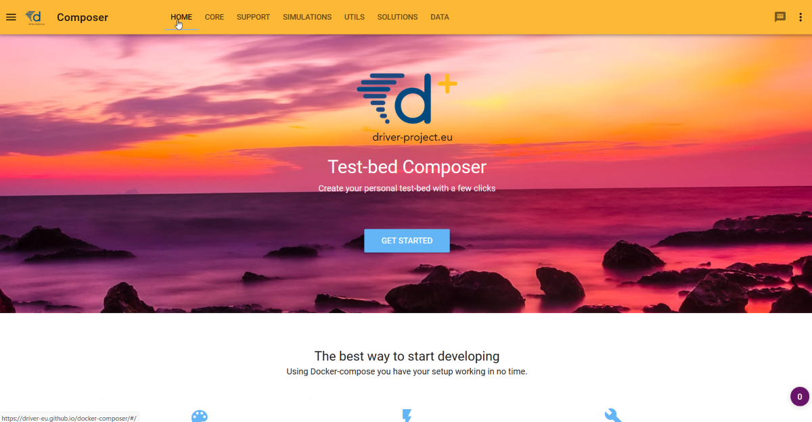
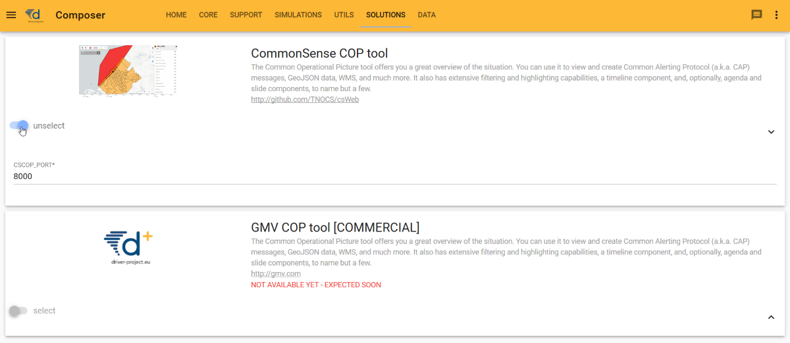
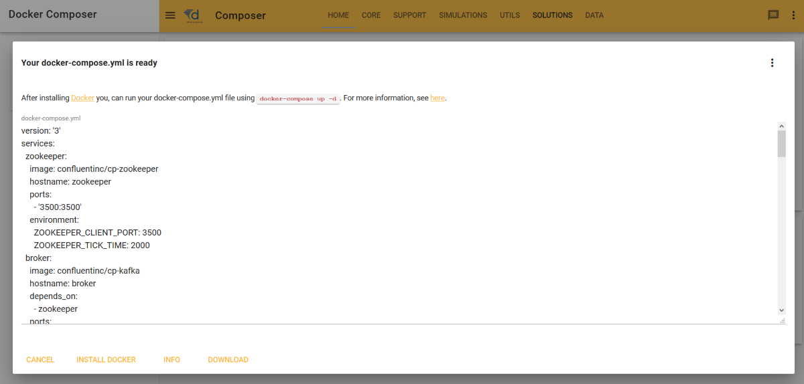

# 3. A Test-bed for Trial owners

Trial owners will interact with the Test-bed when:
- They want to evaluate a solution standalone
- They run a Trial

In the following sections, a use case (storyline) description of each is provided. The main actor in each story is Monica, a regional crisis manager with a professional background in fire-fighting. One of the challenges she is facing is that she does now always have a good overview of where her people and trucks are during a fire, and she is looking for a solution.

## 3.1 Use Case: Evaluating a solution standalone

Monica has heard about an interesting COP solution, *csCOP*, perhaps via the DRIVER+ Portfolio of Solutions, or otherwise. She considers using it to address her problems

1. Monica visits the Test-bed's [composer website](https://driver-eu.github.io/docker-composer).
2. She briefly reads its homepage, which explains her what to do next.

3. She opens the solution's tab and sees that *csCOP* is available for evaluation.
4. She select *csCOP* in the menu.

5. She understands that it is difficult to test a solution without any data / scenario, so she visits the data tab and selects a fire-fighting data set situated in the South of France: *It involves a forest fire, which is rapidly spreading. Ambulances and fire trucks are deployed and driving around. She can also look at census data of the area and a weather report.*

*From here on forwards, two alternatives are presented. The first one represents the desired situation. The second alternative is already in place.*

### Alternative 1: Cloud scenario

6. As she currently isn't interested in other solutions, the opens the menu and clicks on the DEPLOY button. A dialog opens and informs her to wait while her selected Test-bed is started in the cloud.

7. After a minute or so, the Test-bed is running and she gets her own unique link. She visits this website, and is presented with a simple menu: she can start (pause | stop) the fire fighting scenario, and open the website of the *csCOP* tool. *In its layer menu, she can turn on the layer which shows the ambulances and fire trucks. There are also options to turn on the fire fighting layer, etc.*

### Alternative 2: Local scenario

6. As she currently isn't interested in other solutions, the opens the menu and clicks on the BUILD button. A dialog opens and she can download the *Docker-compose* file to her PC.

7. Running a simple command, the Test-bed is downloaded and started on her own PC, and she can interact with the Test-bed as described above.

## 3.2 Use Case: Running a Trial

In order to run a Trial, the same process as described above is followed. The main difference is that more services and solutions will be added, and in many cases, perhaps for security reasons, the Test-bed is run locally on the internal network. Basically, instead of only using the Test-bed core's services, a more complete Test-bed is required, also containing the observer tool, AAR, and Scenario Manager.

In addition, the Test-bed is needed already well-before the final Trial date, since:
- The scenario must be created iteratively.
- Not all solutions or simulators are already able to connect to the Test-bed. So even before the first dry-runs, solutions and simulators should be able to test their connection and integration.

Typically, setting up the Test-bed for a Trial  would not be performed by the Trial owner herself. Most likely, she will be supported by a local system administrator or consultant to help her decide what she needs, and to prepare the technical infrastructure.

When the Test-bed is running, though, the Trial owner has to take responsibility again for defining the scenario in case she has not delegated this task. The scenario is key in that it translates specific objectives to a storyline so the solutions or people can be put to the test.

As the Scenario Manager is not available in the current version of the Test-bed, only a brief outline can be provided. During the preparation, the scenario manager acts as the composer:
- The objectives of the Trial are defined.
- An overall scenario is described that can put these objectives to the test.
- Specific storylines are created to stress the solutions or training audience.

During a Trial, the scenario is started by the Trial owner. The scenario manager, acting as the conductor now, instructs everyone when to perform their planned act. Optionally,she can control the scenario time, for example freezing the time during a break, or to steer the Trial in another direction.
